# Linus Practice Project

## sudo apt upgrade

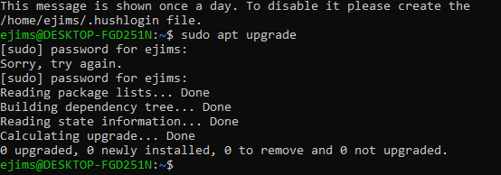

## PWD, i use the pwd command t0 find the path of my current dirctory

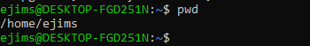

## CD change in directory, navigating through folders and files

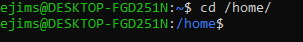

## LS to list all the file in directories with a system

## Touch command, to create an empty folder and modify a timestamp using Linux commands

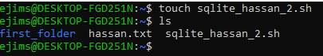

## CP, to copy files, directories and their contents

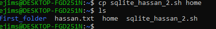

## MV to move and rename file and directories

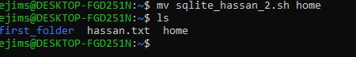

## MV used to rename file the as ubuntu

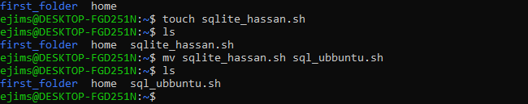

## MKDIR, to make new directory called new_folder

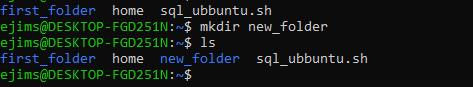

## MKDIR new_folder/old_folder to make a new directory called old_folder in new_folder

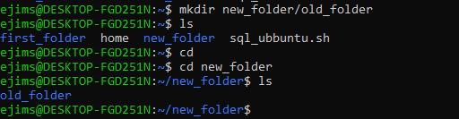

## RMDIR -p new_folder/old_folder, to permenently delete an emty directory.

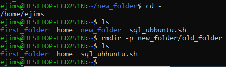

## RM filename, to remove file, also to remove mutiple files

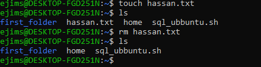

## Locate -i to locate file in database system

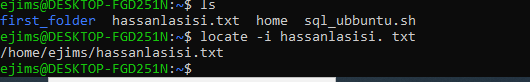

## d -h to see the current directory's disk space in human readable format

## DU COMMAND, to check how much space a directory or file takes up

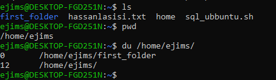

## HEAD COMMAND. to display first ten line of a file

## TAIL COMMAND. to display the last 10 line of file

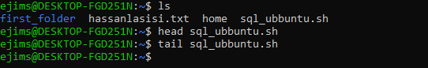

## CHMOD COMMAND. modifies a file or directory's read, write and execute permission

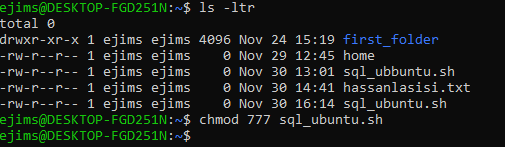
